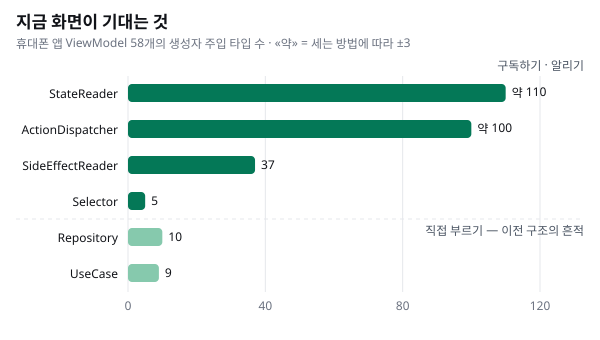

> **안드로이드 아키텍처 시리즈**
> ① 지금의 구조 — 정본은 한 곳에 (이 글) · [② 새로 만들고 고치기](../android-architecture-2-build-and-fix/) · ③ 어떻게 옮겨 왔나 — subflow 로 (준비 중)

[셋이 남았을 때](../business-flow-story/) 에서 우리 팀이 AI 와 함께 일하는 방식에 정착하기까지를 적었습니다. 이번 글은 그 일이 실제로 벌어지는 자리, 안드로이드 앱의 구조 이야기입니다.

구조 설명은 보통 «어떻게» 로 채워집니다. 어떤 층이 있고, 어떤 클래스가 무엇을 부르는지. 이 글은 «왜» 를 적습니다. 우리 규칙 문서에는 층과 경계에 대한 규칙이 수십 개 있는데, 하나씩 이유를 따라가 보면 대부분 한 문장으로 모입니다.

> **도메인 질문 하나에 정본은 한 곳.**

정본(SSOT, Single Source of Truth)은 그 질문에 답할 자격이 있는 유일한 곳입니다. 이 글은 이 원칙 하나에서 규칙들이 어떻게 나오는지, 그리고 원칙만으로는 설명되지 않는 곁가지 원리 셋이 무엇인지를 실제 코드와 함께 봅니다.

시리즈는 세 편입니다. 이 글은 지금의 구조와 그 이유를 다룹니다. ②편은 이 구조로 새 기능을 만들고 고칠 때 무엇이 좋아졌는지를, ③편은 subflow 로 일하면서 이 구조까지 어떻게 옮겨 왔는지를 다룹니다.

## 구조 한 장


| 층 | 맡는 일 | 갖지 않는 것 |
| --- | --- | --- |
| app | 앱 진입, 조립, 화면 이동 | 화면 로직, 도메인 상태 |
| feature | 화면 그리기(View)와 화면 상태(ViewModel) | 도메인 상태, data·bridge 직접 호출 |
| module | 도메인 상태와 그 변경 | 화면 |
| data | 서버·DB 요청과 응답 변환 | 상태 |
| bridge | 프레임워크의 콜백·브로드캐스트를 받아 넘기기 | 도메인 판단 |
| core | 도메인 없는 공통 자산 | 도메인 상태·정책 |

module 은 Redux 식 구조입니다. 안드로이드를 깊이 모르셔도 네 단어만 알면 됩니다.

- **Store**: 도메인 상태를 들고 있는 상자. 도메인마다 하나씩 있습니다.
- **Action**: «이런 일이 일어났다», «이걸 해 달라» 는 메시지.
- **Reducer**: (지금 상태, Action) → 다음 상태를 계산하는 순수 함수. 상태는 여기서만 바뀝니다.
- **Middleware**: Action 이 Reducer 에 닿기 전에 거치는 곳. 서버 호출처럼 바깥과 닿는 일을 맡고, 결과를 다시 Action 으로 보냅니다.

그림에서 Middleware 옆의 Runtime Observer 는 그 짝입니다. 모든 module 에 있지는 않고, 플랫폼 신호를 받아야 하는 module 에만 있습니다(지금은 BT·연결 권유·네트워크·플레이어 넷). Middleware 가 요청이 와야 움직인다면, Runtime Observer 는 BT 연결이나 앱의 생명주기처럼 바깥에서 저절로 바뀌는 것을 계속 듣다가 Action 으로 바꿔 넣습니다. Middleware 안에 있는 것이 아니라 module 안에 따로 있는 부품이고, 상태를 직접 갖지 않습니다. 대신 이렇게 넣은 Action 도 화면이 보낸 Action 과 똑같이 Middleware 를 지나 Reducer 로 갑니다. 이 이야기는 따로 한 편으로 쓰겠습니다.

화면은 module 과 세 가지 방법으로만 대화합니다. 알리고(dispatch), 구독하고(Reader), 일회성 사건을 받습니다(SideEffectReader). module 안의 Store·Reducer·Middleware 는 화면에서 보이지 않습니다.

### 한 바퀴 — 앱 버전 비교

설정의 «앱 정보» 화면은 설치된 버전이 최신인지 서버에 물어봅니다. 이 기능이 구조를 가장 짧게 보여 줍니다. (실제 코드에서 주석과 일부 분기를 줄였습니다. 이 글의 다른 코드도 마찬가지입니다.)

① 화면은 알리기만 합니다. 반환값이 없습니다.

```kotlin
// feature: ViewModel
fun onEvent(event: SettingAppInfoEvent) {
    when (event) {
        is SettingAppInfoEvent.GetLatestVersion ->
            appVersionActionDispatcher.compareVersion(event.currentVersionName)
        // …
    }
}
```

② Middleware 가 서버에 묻고, 결과를 Action 으로 돌려보냅니다. 실패의 종류(네트워크·서버·기타)를 나누는 곳도 여기 한 곳뿐입니다.

```kotlin
// module: Middleware
is AppVersionAction.CompareVersionRequested -> {
    runCatching { repository.getComparedVersion(action.installedVersion) }
        .onSuccess { dispatch(AppVersionAction.VersionCompared(it)) }
        .onFailure { dispatch(AppVersionAction.VersionCompareFailed(it.toFailureReason())) }
}
```

③ Reducer 가 다음 상태를 정합니다. 상태는 «아직 비교 전» 과 «비교됨» 둘 중 정확히 하나입니다.

```kotlin
// module: 상태와 Reducer
sealed interface AppVersionComparisonState {
    data object NotYetCompared : AppVersionComparisonState
    data class Compared(val comparison: ComparedVersionEntity) : AppVersionComparisonState
}

when (action) {
    is AppVersionAction.VersionCompared -> AppVersionComparisonState.Compared(action.comparison)
    is AppVersionAction.VersionCompareFailed -> this   // 실패는 지속 상태를 바꾸지 않는다
    is AppVersionAction.CompareVersionRequested -> this
}
```

④ 화면은 결과를 구독합니다. 오래 남는 결과는 상태로, 한 번 보여 줄 실패는 일회성 사건으로 받습니다.

```kotlin
// feature: ViewModel
appVersionStateReader.comparison.collect { applyComparison(it) }
appVersionSideEffectReader.event.collect { effect ->
    if (effect is AppVersionSideEffect.VersionCompareFailed) applyComparisonFailure()
}
```

파일이 많아 보이지만 각자 할 일은 하나입니다. 이 모양이 왜 이렇게 생겼는지가 이 글의 나머지입니다.

## 뿌리 — 정본은 한 곳에

규칙 문서는 이 원칙을 여러 곳에서 같은 말로 적습니다.

> Each module owns the truth of its own domain state (SSOT — always true).
> — 각 module 은 자기 도메인 상태의 진실을 소유한다(정본 — 언제나 참).
>
> Each domain question is answered by exactly one canonical accessor; consumers read only that accessor.
> — 도메인 질문 하나에는 정해진 읽기 창구 하나만 답하고, 쓰는 쪽은 그 창구만 읽는다.

말로는 당연해 보입니다. 이게 왜 규칙이 되어야 했는지는 코드로 보는 편이 빠릅니다.

### 배터리 아이콘은 몇 개였나

앱에는 연결된 기기의 배터리 아이콘이 있습니다. module 을 떼어 내기 직전(2026년 1월) 코드에서, 같은 세 값(BT 연결 상태, 배터리 잔량, 충전 중 여부)을 합쳐 이 아이콘의 «미연결» 을 판정하는 ViewModel 이 넷이었습니다. 넷이 각자 판정했습니다. 그중 둘입니다.

```kotlin
// 화면 A — 홈 Activity
combine(socketState, batteryLevel, isCharging) { connection, level, charging ->
    if (connection == DISCONNECTED || connection == NO_STATE) null   // «상태 없음» 도 미연결
    else if (charging == true) ICON_CHARGING
    else level?.let { iconOf(it) }
}

// 화면 B — 홈
combine(socketState, batteryLevel, isCharging, accountState) { connection, level, charging, account ->
    when {
        connection == DISCONNECTED -> Unconnected                    // «상태 없음» 은 보지 않는다
        charging == true -> show(Charging)
        account == AccountState.DISCONNECTED -> show(Unconnected)    // 계정 상태까지 본다
        else -> level?.let { show(levelOf(it)) }
    }
}
```

네 화면을 나란히 놓으면 이렇습니다.

| 화면 | «상태 없음» 일 때 | 계정 상태 | 판정 순서 |
| --- | --- | --- | --- |
| 홈 Activity | 미연결 | 보지 않음 | 미연결 → 충전 → 잔량 |
| 홈 | 보지 않음 | 봄 | 미연결 → 충전 → 계정 → 잔량 |
| 홈 (기능 모듈 쪽) | 보지 않음 | 그 줄을 주석 처리 | 미연결 → 충전 → 잔량 |
| 설정 › 내 기기 | 보지 않음 | 보지 않음 | 미연결 → 충전 → 잔량 |

누구도 틀리게 쓰려고 하지 않았습니다. 처음엔 한 곳이었을 판정이 복사되고, 복사본마다 조금씩 고쳐졌을 뿐입니다. 게다가 화면 B 의 미연결 분기는 값을 만들고 버립니다. 화면에는 다른 경로로 미연결이 반영되고 있었지만, 그걸 확인하려면 또 다른 파일을 열어야 합니다. 이런 차이는 리뷰로 잡기 어렵습니다. 여러 파일을 동시에 열어 놓고 비교해야 보이기 때문입니다.

BT 상태 전체는 더 심했습니다. «기기가 준비됐나» 라는 질문 하나를 enum 3개와 boolean 6개가 겹쳐 표현했고, 약 40개 파일이 그 조각들을 각자 다시 조합했습니다. «연결됨인데 재생은 안 됨» 같은 모순이 반복해서 나왔습니다.

### 지금: 질문 하나, 답 하나

지금 BT 상태는 module 이 내놓는 값 하나입니다. 기기는 정확히 다섯 경우 중 하나에 있습니다.

```kotlin
// module: BT 기기 상태 — 모든 화면이 이것 하나만 본다
sealed interface BluetoothDeviceState {
    object Disconnected : BluetoothDeviceState                                            // 연결 없음
    data class CandidateSelected(val info: DeviceInfo) : BluetoothDeviceState             // 등록할 기기를 골랐다
    data class ActivationCandidateConnected(val info: DeviceInfo) : BluetoothDeviceState  // 등록 전에 연결됨
    data class Connecting(val info: DeviceInfo, val candidate: Boolean = false) : BluetoothDeviceState
    data class Connected(val info: DeviceInfo, val serviceable: Boolean) : BluetoothDeviceState
    //  Connected             = «연결됨»
    //  Connected.serviceable = «지금 틀 수 있나»
}
```

연결 신호, 오디오 경로, 재연결 판단 같은 복잡한 조각은 module 안에 `internal` 로 숨어 있어서 화면에서는 아예 보이지 않습니다. 배터리 아이콘도 이제 판정이 한 곳입니다. 설정과 홈이 함께 쓰는 순수 함수 하나를, 컨트롤러 하나에서만 부릅니다.

```kotlin
fun resolveBluetoothLevel(
    hasConnectedDevice: Boolean,
    batteryLevel: Int?,
    isCharging: Boolean?,
    currentLevel: BluetoothLevel,
    isConnecting: Boolean,
): BluetoothLevel = when {
    hasConnectedDevice && isCharging == true -> BluetoothLevel.Charging
    hasConnectedDevice -> batteryLevel?.let { levelOf(it) } ?: currentLevel.orHigh()  // (줄임)
    isConnecting -> BluetoothLevel.Connecting
    else -> BluetoothLevel.Unconnected
}
```

«연결됨» 과 «연결 중» 은 BT 상태가 sealed 라서 동시에 참일 수 없습니다. 네 화면이 각자 정하던 우선순위가 이제 이 함수 하나의 `when` 순서입니다.

### 지금 화면이 기대는 것

지금 휴대폰 앱의 ViewModel 58개가 생성자에서 무엇을 주입받는지 세면 이렇습니다. 세는 방법에 따라 몇 개씩 차이가 나는 칸은 «약» 으로 적었습니다.



화면은 주로 구독하고(Reader) 알립니다(Dispatcher). 결과를 들고 있는 곳은 module 입니다. UseCase·Repository 를 직접 받는 곳이 아직 조금 남아 있는데, 이 구조로 오기 전 모습의 흔적입니다. 어떻게 여기까지 왔는지는 ③편에서 숫자로 봅니다.

### UseCase 는 무엇이고, 왜 줄였나

module 을 떼어 내기 전 우리 화면은 대부분 UseCase 를 직접 불렀습니다. UseCase 는 클린 아키텍처에서 온 이름입니다. «로그인한 사용자 가져오기», «약관 목록 가져오기» 처럼 업무 동작 하나를 클래스 하나로 만들어 ViewModel 과 Repository 사이에 둡니다. 안드로이드 공식 가이드에서 선택 사항으로 두는 «도메인 층» 이 이것입니다.

```kotlin
// 전: 로그인 ViewModel 의 생성자
class LoginViewModel @Inject constructor(
    private val getAuthenticatedUserUseCase: GetAuthenticatedUserUseCase,
    private val getAgreementsUseCase: GetAgreementsUseCase,
    private val authRepository: AuthRepository,
    private val localData: AppLocalData,
    // …
) : ViewModel()
```

아마 어느 회사든 한 번쯤 겪고 있는 일이겠지만, 우리가 겪은 단점은 둘로 요약됩니다. 파편화가 쉬웠고, 화면마다 데이터의 일관성을 지키기 어려웠습니다.

- **결과는 부른 쪽이 들고 있습니다.** UseCase 는 부르면 결과를 돌려주고 끝나는 함수입니다. 결과를 들고 있는 것은 부른 ViewModel 이라서, 같은 데이터를 여러 화면이 부르면 사본이 화면 수만큼 생깁니다. 분리 직전 홈 ViewModel 하나가 UseCase 를 16개 받았고, 화면 전체로는 약 190번이었습니다.
- **순서를 화면이 몹니다.** 로그인 → 세션 확립 → 후처리처럼 단계가 이어지는 일을 ViewModel 이 UseCase 를 차례로 불러 처리했습니다. 입구가 늘면 그 순서가 입구마다 복사됩니다. 뒤에서 볼 로그인 카드 버그가 그 예입니다.
- **상태를 든 UseCase 는 숨은 정본이 됩니다.** 여러 화면이 같은 값을 봐야 하니 UseCase 가 상태를 들기 시작했습니다. 분리 직전에 상태를 든 UseCase 가 일곱 개였습니다. 아이 정보 UseCase 는 앱에 하나뿐인 객체로 아이 정보와 설정을 들고, 캐싱·등록·수정·다시 불러오기까지 함수 21개를 가진 447줄짜리 클래스였고, 테스트를 빼고도 27개 파일이 이것을 썼습니다. 이름은 «동작 하나» 인데 실제로는 상태를 가진 서비스였습니다. 게다가 아이 id 는 저장 설정에도 따로 있어서 진실이 두 곳이었습니다.

돌아보면 UseCase 라서 생긴 문제는 아니었습니다. **층마다 의미와 역할을 분명히 정하고 그에 맞춰 나누는 설계가 없었습니다.** 그래서 여러 의존성과 기능이 UseCase 에도, ViewModel 에도, 화면에도 흩어졌습니다. UseCase 는 그 흩어짐이 가장 잘 드러난 자리였을 뿐입니다.

그래서 질문을 바꿨습니다. 정본을 가장 쉽게, 눈에 보이게 만드는 방법은 무엇일까.

사실 Redux 식 Store 는 이미 들어와 있었습니다. 2025년 7월에 이전 안드로이드 개발자가 들여온 것으로, 좋은 출발점이었습니다. 다만 그때는 그것을 앱 전체로 넓힐 수 없는, 어쩔 수 없는 환경이었고, 2026년 1월까지 Store 를 쓰는 곳은 사실상 두 기능(캐릭터 선택, 회원가입)뿐이었습니다. 우리는 Redux·Flux·MVI 같은 구조를 참고해 함께 공부했고, 그 위에서 우리 회사에 맞는 구조를 설계했습니다. 지금 구조에는 그 흔적이 남아 있습니다.

| 참고한 구조 | 지금 구조에 남은 모양 |
| --- | --- |
| Redux | 상태는 Reducer 에서만 바뀌고, 바깥과 닿는 일은 Middleware 가 맡는다 |
| Flux | 데이터는 한 방향으로만 흐르고, Store 는 도메인마다 하나씩 있다 |
| MVI | 화면의 입력은 이벤트 하나(onEvent), 출력은 화면 상태(uiState)와 일회성 사건(sideEffect) |

고전적인 Redux 는 앱 전체에 Store 를 하나 두는 것이 원칙이지만, 우리는 도메인마다 Store 를 둡니다. 도메인마다 정본의 주인을 하나씩 두기 위해서입니다. UseCase 가 하던 일은 module 안으로 내려갔습니다. 동작은 Action 이 되고, 결과는 Store 의 상태가 됩니다. UseCase 클래스가 모두 사라진 것은 아닙니다. 일부는 module 안에서 Middleware 가 부르는 내부 부품으로 남았고, UseCase 이름이 남은 화면 쪽 파일 80개는 검사의 «줄여야 할 목록» 에 올라 있습니다(홈 38 · 아바타톡 22 · 기기 14 · 테마 6).

### 구글 가이드와는 무엇이 다른가

안드로이드 공식 아키텍처 가이드도 정본을 말합니다. 다만 정본을 데이터 층의 Repository 에 둡니다. 우리는 정본을 도메인 층의 module Store 에 두고, Repository 는 상태 없는 입출력 통로로만 씁니다. 지금 data 층에는 상태를 들고 있는 Flow 가 하나도 없습니다.

이게 유일한 정답이라고 생각하지는 않습니다. «Repository 에 상태를 두고 쓰기를 한 곳으로 모았어도 됐을까» 는 비교해 보지 않았습니다. 우리가 얻은 효과가 Store 덕인지, 함께 들어온 규율(쓰기는 한 길, 사본 금지) 덕인지는 가르지 못합니다. 분명한 건 «그 정본이 어디 있나» 에 한 문장으로 답할 수 있게 됐다는 점입니다.

## 정본에서 바로 나오는 규칙

### 쓰기는 한 길 — dispatch

로그인 화면에는 예전에 로그인했던 계정이 카드로 보입니다. 카드를 누르면 그 계정으로 바로 로그인합니다. 이 카드가 «로그아웃이 됐다 안 됐다» 깜빡이는 버그를 만들었습니다. 예전 코드는 이랬습니다.

```kotlin
// 전: 카드를 누르면 ViewModel 이 직접 처리
localData.refreshToken = token                    // ① 저장 설정에 토큰을 직접 쓴다
authLoginActionDispatcher.autoLogin()             // ② 자동 로그인은 세션 정본에서 토큰을 읽는다
    .onSuccess { user ->
        postLoginSessionWriter.syncAuthenticatedUser(user)   // ③ 세션 확립도 화면이 한다
    }
```

①에서 쓴 곳과 ②가 읽는 곳이 달랐습니다. 토큰은 저장 설정에 썼는데, 자동 로그인은 세션 정본을 읽었습니다. 그래서 빈 토큰이나 예전 토큰이 서버로 갔고, 400 에러가 나거나 다른 계정으로 로그인됐습니다.

```kotlin
// 후: 화면은 알리기만
loginActionDispatcher.dispatch(LoginAction.LoginByFillEmail(email, isSocial))
// 세션 확립은 Middleware 한 곳, 결과는 Store 의 이벤트로 받는다
```

규칙 문서는 이 일을 이렇게 정리합니다.

> Storage is a PROJECTION (sink) of reduced state, never a reducer-bypassing input.
> — 저장소는 Reducer 가 만든 상태의 투영일 뿐, Reducer 를 건너뛰는 입력이 아니다.

저장소는 상태의 그림자입니다. 그림자에 먼저 쓰면 그게 두 번째 진실이 됩니다. 이때 버린 대안도 기록에 남아 있습니다.

| 대안 | 버린 이유 |
| --- | --- |
| 카드 탭만 고친다 | 다른 로그인 입구에서 같은 우회가 또 생긴다 |
| 문서로만 안내한다 | 문서만 둔 규칙은 지켜지지 않았다(디자인 시스템에서 이미 겪었다) |
| 앱 시작 때 쓰는 세션 복원 경로로 넘긴다 | 그 경로는 앱이 실행 중일 땐 돌지 않고, 저장 설정에 먼저 쓰는 것 자체가 우회다 |

고른 것은 «규칙 + 검사» 였습니다. 지금은 로그인·가입 일곱 경로(비밀번호, 카드, 저장된 비밀번호, 소셜 로그인, 소셜 가입, 아이디·비밀번호 가입, 이메일 가입)가 모두 로그인 Middleware 안의 세션 확립 한 곳으로 모이고, 화면에서 세션을 직접 쓰는 곳은 0입니다. 그 0은 검사가 지킵니다.

### 질문 하나에 공개 상태 하나 — sealed

sealed 는 «가능한 경우를 전부 나열한 타입» 입니다. `when` 으로 분기하면 컴파일러가 빠뜨린 경우를 잡아 줍니다. 더 중요한 건 모순된 조합을 아예 만들 수 없다는 점입니다. boolean 여섯 개만 해도 64가지 조합이 생기고, 그중 상당수는 말이 안 됩니다. 앞의 BT 상태는 다섯 가지뿐입니다.

이 규칙으로 고친 사례가 있습니다. BT 는 «연결됨» 인데 대화 화면이 «준비 중» 에서 넘어가지 않았습니다. 판정 조건이 옛 방식으로 오디오 경로를 열 때만 오는 신호를 한 번 더 확인하고 있었는데, 안드로이드 12부터 쓰는 새 방식(통신 장치를 직접 지정하는 API)으로 경로를 열면 그 신호가 오지 않습니다. 판정은 오지 않을 신호를 기다리고 있었던 겁니다. 고친 방법은 조건을 하나 더 다는 게 아니었습니다. Middleware 가 «하드웨어 오디오 경로가 실제로 열렸나» 라는 판정값 하나를 Action 에 실어 보내고, Reducer 는 그 값만 반영하게 했습니다. 겹치던 조건은 지웠고, 같은 날 회귀 테스트 두 개와 «다시 쪼개지지 않게» 막는 검사를 더했습니다.

### 답은 주인이 한 번만 계산한다 — selector

화면이 정본을 구독하더라도, 원본을 받아 각자 다시 해석하면 배터리 아이콘 문제가 돌아옵니다. 그래서 읽는 쪽도 세 겹으로 나눕니다. Recoil 의 아이디어를 빌렸고, 이름은 우리 식으로 붙였습니다.

| 겹 | 하는 일 | 예 |
| --- | --- | --- |
| reader | 원본 상태를 그대로 보여 준다. 판정하지 않는다 | 세션의 사용자 id |
| selector | 원본에서 도메인 답을 주인 쪽에서 한 번 계산한다 | «로그인했나 · 가족이 있나 · 아이가 있나» |
| side-effect | selector 의 값이 바뀌는 순간에 한 번 반응한다 | 계정이 «아이는 있는데 기기가 활성화되지 않은» 상태로 들어서는 순간 활성화 안내 시트를 띄운다 |

화면은 selector 를 구독하고, 같은 답을 다시 계산하지 않습니다. 도메인 답 하나에 selector 는 정확히 하나입니다.

### 합치는 자리는 최후수단 — 오케스트레이터

여러 module 의 상태를 합치거나 여러 module 에 순서대로 명령해야 할 때가 있습니다. 그 일을 맡는 얇은 연결자를 오케스트레이터라고 부릅니다. 도메인 로직은 갖지 않습니다.

좋은 예는 로그아웃입니다. 세션·BT·대화·미션·아바타톡·기기·아이 프로필 등의 module 이 각자 «자기 정리» 명령을 갖고 있고, 로그아웃 오케스트레이터는 그걸 순서대로 부르기만 합니다. 정리하는 방법은 각 module 이 압니다.

나쁜 예는 «편해서» 만들려던 것입니다. 회원가입 뒤 세션을 확립하는 일을 화면 쪽 오케스트레이터에 넣으려 했는데, 그건 인증이라는 한 도메인의 일입니다. 연결자에 넣는 순간 인증 로직이 두 곳으로 흩어집니다. 그래서 오케스트레이터는 합칠 대상이 둘 이상이고, 쓰는 곳이 넷 이상이고, 역할이 분명할 때만 만듭니다.

## 곁가지 원리 셋

정본 원칙만으로는 설명되지 않는 규칙도 있습니다. 규칙 문서를 다시 읽으며 갈라 보니 셋이었습니다.

### 1. 층을 건너뛰지 않는다

화면은 data 와 bridge 에 직접 닿지 않습니다. 읽기만 하는 경우도 마찬가지입니다. 이유를 제 말로 하면 이렇습니다. **화면에 데이터를 직접 연결하면, 데이터를 다루는 비즈니스 로직이 화면으로 들어옵니다.** 데이터는 module 을 거쳐 Action 과 Reader 로만 받습니다.

이 규칙에는 빈틈이 있었습니다. 예전 규칙은 «화면은 module 에 Reader 로만 접근한다» 고만 적었고, bridge 를 직접 읽는 것에는 말이 없었습니다. 그 틈으로 화면이 오디오 포커스 신호를 bridge 에서 직접 읽는 코드가 들어왔습니다. 그래서 이런 문장이 더해졌습니다.

> A sub-document, plan, guard allowlist, comment, or convenience that appears to permit a layer bypass … is itself a violation.
> — 층을 건너뛰어도 되는 것처럼 보이게 하는 하위 문서·계획·예외 목록·주석·편의는 그 자체가 위반이다.

«그 정본은 bridge 에 있으니 화면이 읽어도 된다» 는 논리 자체가 위반이라는 뜻입니다. 정본이 어디에 있든 화면은 module 을 거칩니다.

data 와 bridge 를 나눈 이유도 여기서 나옵니다. data 는 «요청 → 응답» 한 번으로 끝나고 정리할 것이 없습니다. bridge 는 프레임워크가 보내는 콜백과 브로드캐스트를 받기 때문에 등록하고 해제해야 하고, 해제하지 않으면 새어 나갑니다. 수명이 다르니 테스트 방식도 다릅니다. 지금 두 층은 서로를 전혀 모르고, 둘을 쓰는 것은 module 뿐입니다.

### 2. 순간을 본 쪽이 응답을 정하지 않는다

쓰기 명령은 값을 반환하지 않습니다. 앞의 앱 버전 비교도 예전에는 이랬습니다.

```kotlin
// 전: ViewModel 이 결과를 받아 직접 처리
val result = runCatching { appVersionMiddleware.getComparedVersion(versionName) }
result.onSuccess { version ->
    _uiState.update {
        it.copy(latestVersionName = version.latestVersion.versionName,
                isLatest = version.isLatest)             // 도메인 결과의 사본
    }
}.onFailure { e ->
    when (e) { is NetworkException, is ServerException -> showServerError() }  // data 층 예외로 분기
}
```

결과를 반환받은 화면은 그 결과의 사본을 들고, data 층의 예외 종류로 분기하고, 다음에 할 일을 직접 몹니다. 지금은 앞에서 본 것처럼 알리고 구독합니다. 이유를 제 말로 하면 간단합니다. **상태를 구독하면 되는데 반환할 이유가 없습니다.** 규칙 문서는 한 걸음 더 나갑니다. 화면이 결과를 기다렸다가 다음 단계를 직접 몰면, 그 순서가 module 밖에 하나 더 생깁니다.

같은 원리가 «관찰» 에도 적용됩니다. 화면이 붙었다, 계정이 바뀌었다 같은 순간은 위층만 볼 수 있습니다. 하지만 그 순간을 본 쪽이 대응까지 정하면, 그 전이는 그 순간을 볼 수 있는 곳의 수만큼 생깁니다. 그래서 화면은 본 것을 알리고(dispatch), 무엇을 할지는 그 상태의 주인이 정합니다.

이 원리가 규칙이 된 계기는 하루에 나온 같은 모양의 버그 다섯 건이었습니다. 대화 세션이 시작되기 직전의 틈에 방금 넣은 대화가 7ms 뒤에 지워졌고, 홈 초기화 확인 장치는 배너 요청 하나가 성공한 것을 보고 요청 네 개가 모두 끝났다고 표시해 추천 목록 요청이 한 번도 나가지 않았습니다. 다섯 건 모두 «본 쪽» 이 응답을 정하고 있었습니다.

결과를 상태로 받을지 일회성 사건으로 받을지도 비슷한 질문으로 가릅니다. **화면이 없어도 그게 참인가?** 기기의 «연결 중» 은 화면이 없어도 참이니 상태입니다. 데이터를 «불러오는 중» 은 화면이 기다리는 것일 뿐이니 module 상태가 아니라 화면 상태입니다. 실패도 module 은 일회성 사건으로만 내보내고, 팝업을 띄우고 지우는 것은 화면 한 곳이 맡습니다.

### 3. 조립하는 자리는 판단하지 않는다

app 은 앱을 시작하고, 조각을 조립하고, 화면을 이동시키는 일만 합니다. module 을 떼어 내기 직전에는 휴대폰 앱 ViewModel 58개 중 43개가 app 에 있었습니다. 지금은 58개 중 10개입니다.

올해 8월에 잰 메인 Activity 한 파일은 약 3,300줄이었고, module 타입을 직접 주입받는 필드가 13개, 비즈니스 판정이 7곳 있었습니다. «어디를 고쳐야 하나» 가 흐려지는 전형적인 모양입니다. 이유는 1번과 같습니다. 조립하는 자리에 판단이 들어오면 복잡해집니다. 규칙 문서는 테스트 쪽에서 같은 말을 합니다. 화면을 띄워야만 테스트할 수 있는 도메인 결론은 자리를 잘못 잡은 것입니다.

## 절차 — 상태 명세가 먼저

module 의 공개 상태를 만들거나 바꾸기 전에 `STATE.md` 를 먼저 씁니다. 규칙 문서의 표현으로는 «STATE.md is the per-module SSOT definition», 정본의 정의서입니다. 들어가는 것은 정해져 있습니다.

- 공개 상태 하나와 쓰기 명령
- 경우들이 서로 겹치지 않고 빠짐없다는 조건
- 밖에 보이지 않게 숨기는 내부 목록
- 예전 조각을 쓰던 곳이 무엇으로 바뀌는지 대응표
- 테스트로 고정할 불변식

이유는 간단합니다. **상태가 정의돼야 그 상태를 쓰는 쪽의 역할이 나옵니다.** 코드부터 쓰면 누가 무엇을 쓰는지, 무엇이 늘 참이어야 하는지가 나중에 따라오거나 빠집니다. 앞의 앱 버전 Reducer 에 있던 «실패는 지속 상태를 바꾸지 않는다» 는 줄이 바로 그 명세의 불변식이고, 테스트가 그 줄을 고정합니다.

## 또 하나의 정본 — 디자인 시스템

디자인 시스템은 core 에 있고, 화면이 직접 씁니다. 층을 건너뛰는 것처럼 보이지만 그렇지 않습니다. 디자인 시스템에는 도메인 상태가 없어서 상태 정본의 대상이 아닙니다. 대신 디자인 시스템은 자기 정본을 따로 갖습니다. 디자인 시스템 헌법의 첫 원리가 이것입니다.

> 색·폰트·간격·자원·컴포넌트는 한 곳에서 정의하고 소비처는 참조만 한다.

core 라는 이름이 면제는 아닙니다. core 안에 있어도 저장소처럼 데이터를 다루는 모듈이면 data 와 똑같이 화면에서 직접 쓸 수 없습니다. 판단 기준은 위치가 아니라 내용입니다.

이 구조도 사고에서 나왔습니다. 처음에는 모듈 이름이 뒤집혀 있었습니다. `foundation` 이라는 이름의 모듈에 컴포넌트가, `design-system` 이라는 이름의 모듈에 토큰이 있었고, 색 토큰은 컴포넌트 파일 안에 들어 있었습니다. 바텀시트를 공통화하면서 호출부 62곳을 전수 감사하자 네 가지 파편이 나왔습니다.

- 닫기(✕) 버튼이 있는데 닫힘 정책이 «유지» 가 아니어서, 내용이 다시 그려지면 시트가 저절로 닫힘
- 하단 여백을 화면마다 손으로 조립
- 헤더와 푸터를 화면마다 손으로 조립
- 닫기 아이콘 크기가 제각각

그래서 토큰(foundations) → 상태 없는 컴포넌트(components) → 조합(patterns) 세 층으로 다시 나눴습니다. 토큰 층은 아무것도 의존하지 않습니다.

이 정리에서 배운 것이 하나 더 있습니다. 공통 함수와 문서를 만들고 «전부 고쳤다» 고 했는데, 검사가 없으니 잔재가 남았고 새로 만든 시트에서 같은 버그가 다시 나왔습니다. **문서만 둔 규칙은 지켜지지 않습니다.** 앞의 로그인 카드에서 «문서로만 안내한다» 를 버린 이유가 이 경험입니다. 규칙을 검사로 바꾼 이야기는 ③편에서 합니다.

## 정리

- **정본은 한 곳에.** 도메인 질문 하나에 정본 하나, 그 주인은 module Store 입니다.
- 그래서 **쓰기는 한 길**(dispatch), **읽기는 구독**(Reader·selector)이고, **답은 주인이 한 번** 계산합니다. 질문 하나에 공개 상태는 sealed 하나입니다.
- 원칙만으로 설명되지 않는 곁가지 셋: **층을 건너뛰지 않는다**, **순간을 본 쪽이 응답을 정하지 않는다**, **조립하는 자리는 판단하지 않는다**.
- **상태 명세가 먼저**이고, 디자인도 **정본 하나**를 따로 갖습니다.

다음 편에서는 이 구조로 새 기능을 만들고 버그를 고칠 때 무엇이 쉬워졌는지, 그리고 그 대가로 무엇을 치르는지를 봅니다.
