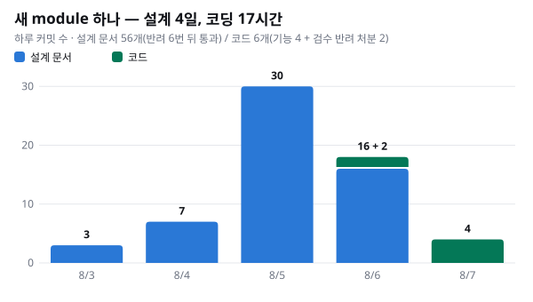
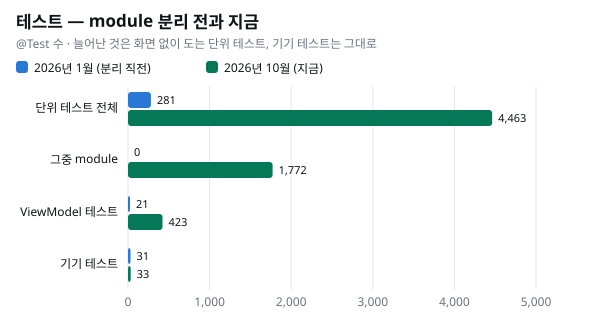

> **안드로이드 아키텍처 시리즈**
> [① 지금의 구조 — 정본은 한 곳에](../android-architecture-1-one-truth/) · ② 새로 만들고 고치기 (이 글) · ③ 어떻게 옮겨 왔나 — subflow 로 (준비 중)

[①편](../android-architecture-1-one-truth/) 에서 지금의 구조와 그 이유를 봤습니다. 도메인 질문 하나에 정본은 한 곳, 그 주인은 module Store 라는 원칙이었습니다. 이번 편은 그래서 무엇이 좋아졌는지입니다.

구조 글은 대개 장점을 말로 적습니다. «유지보수가 쉬워졌다», «테스트하기 좋다». 이 글은 저장소에서 센 숫자와 실제 커밋으로만 말하겠습니다. 근거가 약한 곳은 약하다고 적고, 좋아지지 않은 것과 대가도 함께 적습니다.

## 새 기능 만들기 — 순서가 정해져 있다

올해 8월에 만든 module 하나를 따라가 보겠습니다. 기기 연결을 권하는 안내를 사용자가 닫았을 때, 그 안내를 언제 다시 띄울지 정하는 module 입니다.

### 코드보다 명세가 먼저

이 module 의 첫 커밋에는 Kotlin 코드가 한 줄도 없습니다. 상태 명세(STATE.md), 규칙 문서의 module 색인 한 줄, 빌드 설정뿐입니다. 명세는 이 module 이 답할 질문 하나로 시작합니다(카티는 우리 기기의 이름입니다).

> 카티 연결 권유를 지금 노출해도 되나 — 사용자가 억제했다면 언제까지인가.

그리고 답의 모양을 먼저 정합니다. 아래는 처음 명세에 적힌 모양 그대로입니다.

```kotlin
sealed interface PromptEligibility {
    data object Eligible : PromptEligibility                              // 노출 가능
    data class Suppressed(val boundary: SuppressionBoundary) : PromptEligibility
}

sealed interface SuppressionBoundary {
    data class UntilNextDay(val epochDay: Long) : SuppressionBoundary     // [오늘은 그만 보기] — 다음날 0시
    data object UntilNextForeground : SuppressionBoundary                 // [X 닫기] — 백→포 재진입까지
}
```

«백→포 재진입» 은 앱이 뒤로 갔다가(백그라운드) 다시 앞으로 나오는 것(포그라운드)입니다. 경계는 나중에 하나 더 생겨서(«홈 화면이 보일 때까지»), 지금 코드에는 셋입니다. 명세에는 이런 결정도 함께 적혀 있습니다.

- **두 억제가 겹치면 더 긴 쪽이 이긴다.** 짧은 쪽으로 풀리면 «오늘은 그만» 이라고 했는데 오늘 안에 다시 뜹니다.
- **저장하는 방식이 다르다.** «다음 날까지» 는 저장해서 앱이 꺼졌다 켜져도 유지하고, «앱에 다시 들어올 때까지» 는 메모리에만 둡니다. 앱을 다시 켜는 것 자체가 «다시 들어온 것» 이기 때문입니다.
- **이 module 이 갖지 않는 것.** 안내를 띄우는 조건 일곱 개를 합치는 일은 ViewModel 이 맡습니다. 처음 명세부터 적혀 있던 결정이고, BT 스캔의 수명은 BT module 이, 이미지 팝업은 다른 module 이 맡는다는 것은 나중에 더해졌습니다. 이 module 은 «막혔나, 언제까지» 하나만 답합니다.

①편에서 말한 «상태 명세가 먼저» 가 실제로는 이런 모양입니다. 정해야 할 것이 질문 목록으로 정해져 있어서, 빈 화면 앞에서 «무엇부터 하지» 를 고민하지 않습니다.

### 그다음은 정해진 순서대로

코딩은 기능 커밋 네 개였습니다(검수 반려를 처리한 커밋 둘은 따로 셉니다).

1. module 을 만들고 상태 명세·색인 한 줄·빌드 설정을 넣는다(Kotlin 코드 0줄)
2. 모델·Dispatcher·Reader·Reducer·Store·DI 와 정책 테스트
3. Middleware·앱 상태 관찰·저장과 그 테스트
4. ViewModel(150줄)과 그 테스트(265줄)

첫 커밋부터 ViewModel 까지 약 17시간이었습니다. 그런데 이 숫자만 보면 오해하기 쉽습니다. 그 앞에 설계가 4일 있었습니다.



8월 3일부터 6일까지 설계 문서 커밋이 56개였고, 독립 검수와 완료 기준 게이트에서 여섯 번 반려된 뒤 일곱 번째에 통과했습니다. 첫 코드 커밋은 그 11분 뒤였습니다. 그러니 정확히는 «순서 덕에 빨랐다» 가 아니라 «설계를 앞에서 끝냈기 때문에 코딩이 기계적이었다» 입니다. 순서가 없었다면 얼마나 더 걸렸을지는 비교해 보지 않았습니다.

순서를 지켰다고 실수가 없지도 않았습니다. 실행 단계의 독립 검수가 두 가지를 잡아 반려했습니다. 하나는 Reducer 안에서 함수 이름이 겹쳐 자기 자신을 끝없이 부르는 재귀였고, 다른 하나는 바로 옆 BT module 의 스캔 신호가 연결되지 않은 것이었습니다. 정책 테스트가 16개 있었지만 모두 순수 함수만 불러 실제 Store 를 거치지 않았기 때문에 재귀를 놓쳤습니다. 그래서 Store 를 실제로 거치는 회귀 테스트 두 개를 더했습니다.

## 고치기 — 주인 한 곳에서

### 한 곳을 고치면 모든 화면이 같이 고쳐진다

9월 말, 아이·기기 프로필 Store 에서 문제를 찾았습니다. Action 을 처리할 때 «지금 상태 읽기 → 다음 상태 계산 → 쓰기» 가 세 단계로 나뉘어 있어서, 두 요청이 거의 동시에 들어오면 한쪽의 갱신이 사라질 수 있었습니다. 고친 방법은 «비교 후 교체(CAS)» 를 재시도하는 방식으로 세 단계를 한 번에 처리하는 것이었습니다.

손댄 파일은 넷(Store 둘과 그 테스트 둘)이고, ViewModel 은 하나도 바뀌지 않았습니다. 이 두 상태를 읽는 파일은 스무 개 안팎이고 그중 ViewModel 이 6개인데, 모두 이 수정의 효과를 한 번에 받습니다. 동시성 문제라서 실제로 여러 화면에서 증상이 보였다는 기록은 없습니다. 다만 «주인 한 곳을 고치면 모든 소비처가 같이 고쳐진다» 를 구조로 보여 주는 사례입니다.

### 고칠 자리가 하나라는 것

9월 중순에는 대화가 서버 오류로 끝나면 «대화 종료» 분석 이벤트가 나가지 않는 문제가 있었습니다. 실패가 일어나는 곳마다 이벤트를 심는 방법도 있었지만 버렸습니다. 커밋에 그 이유가 적혀 있습니다. 그렇게 하면 이음새가 실패 지점의 수만큼 늘어납니다. 대신 대화 상태를 관찰하는 한 곳에 16줄을 더해 고쳤습니다.

### 전에는

module 을 떼어 내기 전인 2025년 7월, «선호 주제를 등록해도 추천 목록에 바로 반영되지 않는» 버그가 있었습니다. 그때는 파일 12개, ViewModel 5개를 하나하나 고쳤습니다. 버그의 종류가 달라서(값이 전달되지 않은 것과 동시성) 같은 버그의 전후 비교는 아닙니다. 그래도 고칠 자리가 화면 수만큼 있던 시절의 모양은 이랬습니다.

## 테스트 — 화면 없이 돈다

규칙 문서는 층마다 따로 돌리고 따로 테스트할 수 있어야 한다고 적습니다. 그중 한 문장이 이 구조의 테스트 전략을 요약합니다.

> A domain conclusion that can only be tested through a screen is mis-placed (push it down).
> — 화면을 거쳐야만 테스트할 수 있는 도메인 결론은 자리를 잘못 잡은 것이다(아래로 내려라).

층이 나뉘어 있으니 테스트도 층마다 따로 돕니다.

| 테스트 | 무엇을 넣고 무엇을 보나 | 없어도 되는 것 |
| --- | --- | --- |
| 화면 | ViewModel 의 onEvent 에 이벤트를 넣고 uiState 가 어떻게 바뀌는지 본다. module 은 가짜 Reader 로 대신한다 | 화면을 띄우는 일 |
| 도메인 | Store(module) 에 Action 을 보내고 State 와 일회성 사건을 본다 | 화면, 기기 |
| 네트워크 | data 층에서 요청과 응답 변환만 따로 본다 | Store, 화면 |
| 이음새 | 층과 층이 만나는 자리를 본다. 예를 들어 실제 Middleware 에 가짜 bridge 를 끼운다 | 실제 기기 |

숫자로 보면 이렇습니다.



늘어난 것은 화면 없이 도는 단위 테스트입니다. 단위 테스트는 약 16배가 됐고, 기기에서 도는 테스트는 31개에서 33개로 거의 그대로입니다. module 테스트 1,772개는 전부 순수 JVM 에서 돕니다. 테스트 코드는 안드로이드 테스트 러너도, 안드로이드를 흉내 내는 라이브러리(Robolectric)도 쓰지 않습니다.

예를 들어 BT 연결을 다루는 Store 의 테스트는 실제 Middleware 에 가짜 bridge 를 끼워 넣고, Action 을 보낸 뒤 일회성 사건이 나오는지 확인합니다. 기기도 에뮬레이터도 필요 없습니다. 도메인의 결론이 module 안에 있기 때문에 가능한 일입니다.

버그 수를 따로 세어 두지는 않았지만, 효과는 분명했습니다. 화면 테스트를 onEvent 와 uiState 로 떼어 낸 뒤로 화면 개발에서 나던 버그가 많이 줄었습니다. 화면을 띄우지 않고도 «이 이벤트가 오면 화면 상태가 이렇게 된다» 를 확인할 수 있기 때문입니다. Store 의 도메인 테스트와 이음새 테스트 덕에, 화면마다 값이 어긋나던 데이터 정합성 버그도 많이 줄었습니다.

## 바꾸기 — 정책 하나에 고치는 곳 하나

9월에 로그인 흐름의 정책을 하나 바꿨습니다. 로그인이 끝난 뒤의 후처리(푸시 알림 토큰 등록)를 기다리지 않고, 성공을 먼저 알린 다음 후처리는 따로 보내기로 한 것입니다. 커밋에 적힌 증상은 재로그인 31~32초, 스플래시 14.8초였습니다. 고친 뒤 실제로 얼마나 빨라졌는지는 앱에서 재지 않았습니다.

바뀐 파일은 다섯 개였고 모두 로그인 module 안에 있었습니다. ViewModel 은 하나도 바뀌지 않았습니다. 그런데 이 한 곳을 바꾸자 카드 로그인, 저장된 비밀번호로 다시 시도하기, 앱 첫 실행 세 경로가 같이 바뀌었습니다. ①편에서 본 것처럼 모든 로그인·가입 경로가 Middleware 안의 세션 확립 한 곳으로 모이기 때문입니다.

물론 그 한 곳을 만드는 데는 비용이 들었습니다. 7월에 회원가입의 세션 확립을 그 자리로 옮긴 커밋은 파일 19개를 바꿨고, 회원가입 ViewModel 한 파일에서만 479줄이 바뀌었습니다. 흩어진 것을 주인에게 모으는 일은 비쌉니다. 한 번 모으고 나면, 그다음 정책 변경은 주인 쪽 파일 다섯 개로 끝납니다.

## 여럿이 동시에 — 코드는 거의 부딪히지 않는다

우리는 여러 작업을 동시에 돌립니다. 사람과 AI 세션이 각자의 작업 공간(git worktree)에서 일하고, 로컬 통합 CI 가 그 결과를 한 줄로 합쳐 빌드하고 검사합니다.

9월 11일부터 10월 6일까지 통합 CI 는 264번 돌았습니다(브랜치 67개). 통과 229번, 실패 33번, 병합 충돌 2번입니다. 충돌이 난 파일을 모아 보면 코드 파일은 예제 성격의 테스트 파일 하나뿐이었고, 나머지는 모두 문서와 색인이었습니다. 설계 문서, 결정 기록 색인, 변경 이력입니다. 통합 브랜치로 들어온 병합은 9월 23일부터 10월 7일까지 146건, 많은 날은 하루 39건이었습니다.

모듈 경계 덕에 코드 충돌이 줄었다고 단정하기는 어렵습니다. 경계를 만들기 전과 비교할 기록이 없고, 사람이 미리 풀어 버린 충돌은 셀 수 없기 때문입니다. 다만 «코드 충돌은 사실상 없고, 충돌은 함께 쓰는 문서에 몰린다» 는 모양은 분명합니다. 그 자체가 뒤에서 말할 대가이기도 합니다.

## AI 와 일하기 — 첫 시도가 아니라 되풀이할 수 있는 검수

AI 에게 일을 맡기는 방식은 이렇습니다. 지시서 한 장에 단계 하나, 만드는 쪽과 검수하는 쪽은 서로 다른 세션, 커밋 전에는 러너가 검사를 다시 돌립니다. 만든 쪽의 «통과했다» 는 증거로 받지 않습니다.

설정 화면을 옮긴 작업의 실행 기록을 보면 단계 147개 중 28개에서 반려가 있었습니다. 한 단계의 반려 한 번에서 나온 지적 셋을 보면 검수가 무엇을 잡는지 보입니다. 대부분 층을 잘못 고른 실수입니다.

- 판정 로직을 화면 연결만 하는 자리(Route)에 둠 → ViewModel 로
- 팝업이 닫혔는지를 화면 안의 로컬 상태로 둠 → ViewModel 이 갖도록
- 화면을 지우면서 검사가 요구하는 테스트를 놓침

통합 CI 실패 33번 중 코드가 깨진 것(컴파일·테스트)은 5번이고, 28번은 규칙·문서 검사에서 걸렸습니다.

그래서 «정해진 모양이 있으니 AI 가 첫 시도에 맞춘다» 고는 말할 수 없습니다. 그런 근거는 없습니다. 맞는 말은 이쪽입니다. **정해진 모양이 있으니 검수가 무엇을 잡아야 할지 분명하고, 반려 → 정정 → 통과를 되풀이할 수 있습니다.**

## 대가

좋아진 것만큼 치르는 것도 있습니다.

- **파일이 많습니다.** 앱 버전 비교 기능 하나에 module 파일 12개(그중 하나는 옛 잔재), data 파일 7개, 테스트 3개가 있습니다.
- **설계가 코딩보다 깁니다.** 앞의 module 은 설계 문서 커밋이 56개(4일), 코드 커밋이 4개(약 17시간)였습니다.
- **검사를 유지하는 비용이 듭니다.** 규칙을 지키는 검사 스크립트가 약 70개, 파이썬으로 약 2만 줄입니다. 규칙 문서만 약 2,500줄이고, 규칙과 작업 흐름 문서를 모은 폴더는 4만 줄이 넘으며, 결정 기록이 따로 약 1만 5천 줄 있습니다.
- **충돌이 문서로 몰립니다.** 코드가 덜 부딪히는 대신 함께 쓰는 문서와 색인이 자주 부딪힙니다.
- **배울 것이 많습니다.** Reader·Selector·일회성 사건, sealed 상태, 상태 명세 같은 약속을 익혀야 합니다. 숫자로 재지는 못했지만, 처음 오는 사람에게도 AI 에게도 진입 비용입니다.

## 정리

- **새로 만들 때**: 정해야 할 것이 질문 목록으로 정해져 있어 코딩이 기계적입니다. 대신 설계가 깁니다.
- **고칠 때**: 주인 한 곳을 고치면 모든 소비처가 같이 고쳐집니다.
- **테스트할 때**: 화면·도메인·네트워크·이음새를 따로 테스트합니다. 화면 없이 도는 단위 테스트가 약 16배가 됐고, 화면 개발 버그와 데이터 정합성 버그가 많이 줄었습니다.
- **바꿀 때**: 정책 하나에 고치는 곳 하나입니다. 그 한 곳을 처음 만드는 비용은 큽니다.
- **여럿이 일할 때**: 코드는 거의 부딪히지 않고, 대신 문서가 부딪힙니다.
- **AI 와 일할 때**: 첫 시도가 맞는 게 아니라, 검수가 잡을 것이 분명해집니다.

이 구조는 처음부터 이렇게 생기지 않았습니다. 2026년 1월에는 module 이 하나도 없었고, 화면은 UseCase 를 약 190번 불렀습니다. 마지막 편에서는 subflow 로 일하면서 여기까지 어떻게 옮겨 왔는지를 봅니다.
