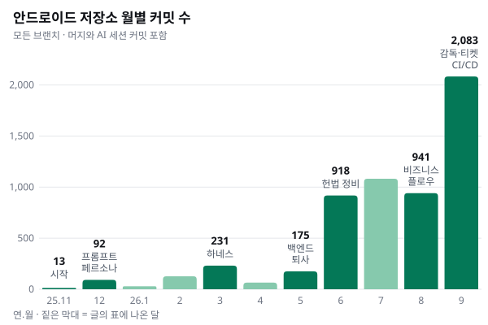

이 글은 «비즈니스 플로우가 무엇인가»를 설명하는 글이 아닙니다. 우리 팀이 **어쩌다 이 방식을 쓰게 됐고, 지금 어떻게 쓰고 있으며, 어떻게 키워 가고 있는지**에 대한 기록입니다.

## 남은 사람은 셋이었다

2025년 11월, 안드로이드 개발자가 퇴사했습니다.

안드로이드 앱을 맡을 사람이 없었고 제가 직접 개발을 시작했습니다. 솔직히 말하면 저는 안드로이드를 거의 해 본 적이 없었습니다. 예전에 수업으로 배운 것과 토이 프로젝트 하나가 전부였습니다.

**죽기 아니면 까무러치기**라고 생각했습니다. 그달부터 AI 에이전트와 함께 개발하는 방식을 본격적으로 시작했습니다. 저장소 기록을 보면 AI 에이전트용 지침 파일이 처음 들어간 날이 2025년 11월 27일입니다.

올해 5월에는 백엔드 개발자도 퇴사했습니다. 주요 비즈니스 로직을 제가 인수인계받았습니다.

그렇게 남은 개발 인력은 **iOS 개발자 두 명과 저, 셋**이었습니다. 안드로이드 앱, 서버, 운영 도구까지 해야 할 일은 그대로인데 사람은 절반이 됐습니다.

## 유행하는 AI 기술을 거의 다 써 봤다

처음 반년은 새로 나오는 AI 기술을 닥치는 대로 적용해 봤습니다.

- **2025년 12월, 프롬프트 엔지니어링** — 역할을 정해 주는 페르소나를 붙이고 더 잘 묻는 법부터 다듬었습니다.
- **컨텍스트 엔지니어링** — AI 가 맥락을 잃지 않도록 아키텍처 그래프와 미리 엮어 둔 맥락 문서를 저장소에 쌓았습니다.
- **공개된 유명 스킬셋** — 잘 만들어졌다는 스킬 모음을 가져다 우리 작업에 붙여 봤습니다.
- **2026년 3월, 삽질의 본격화** — 막 쓰이기 시작한 «하네스» 라는 개념을 우리 저장소에 적용해 보려고 애썼습니다. 작업 큐, 정책, 가드, 실행기를 파이썬 파일 수백 개 규모로 직접 만들고 같은 지시를 될 때까지 반복시키는 루프와 슬랙으로 일을 받아 도는 자동 조종까지 붙였습니다.

하나하나는 그럴듯했습니다. 하지만 2026년 5월부터 7월까지, 저는 이것들을 여러 번에 걸쳐 걷어냈습니다. 지운 파일만 수백 개입니다. 6월 16일에는 하네스를 지우는 커밋과, 흩어진 규칙 문서를 «헌법» 으로 옮기는 커밋이 같은 날 들어갔습니다.

다만 지운 것은 도구였지 생각이 아니었습니다. **subflow** 라는 말은 그때 만든 하네스 안에서 처음 등장했고 여러 작업을 지켜보는 **감독(supervisor)** 도 그때 이미 실험하고 있었습니다. 둘 다 지금의 비즈니스 플로우에 그대로 남아 있습니다.

돌아보면 공통된 벽이 하나 있었습니다. **AI 가 무엇을 할지 예측할 수 없었다**는 것입니다. 같은 요청에도 세션마다 결과의 모양이 달랐고 잘될 때와 안될 때의 차이를 설명할 수 없었습니다. 혼자서 세 사람 몫을 맡은 상황에서는, 빠른 것보다 **매번 같은 모양으로 움직이는 것**이 더 중요했습니다.

그 벽을 넘은 방법이 결국 «플로우»였습니다.

## 예측할 수 있는 가장 작은 단위부터

AI 를 많이 다뤄 보지 않은 상태에서 처음부터 큰 그림을 그리면 실패합니다. 그래서 거꾸로, **AI 의 행동을 예측할 수 있는 가장 작은 단위**부터 정의했습니다. 우리는 그것을 **subflow** 라고 부릅니다. 단계 하나의 계약입니다.

subflow 하나에는 이런 것이 정해져 있습니다.

| 항목 | 뜻 |
| --- | --- |
| 입력 | 어느 단계의 어떤 산출을 받는가 |
| 산출 | 어떤 파일을, 무엇을 어떤 축으로 세어 내놓는가 |
| 통과 체크 | 입력을 빠짐없이 소비했는가 |
| 결정 반출 | 이 단계에서 나온 결정을 결정 대장 한 곳으로 넘긴다 |
| 실패 반송지 | 틀렸다면 **그 판정을 처음 만든 단계**로 돌아간다 |

입력과 산출이 정해진 단계는 **누가 돌려도 같은 모양으로** 움직였습니다. 처음으로 AI 의 결과를 예측할 수 있게 된 순간이었습니다.

이 단계들을 앞 단계의 산출이 뒤 단계의 입력이 되도록 줄 세우면 그것이 **rootflow**, 우리가 **비즈니스 플로우**라고 부르는 흐름이 됩니다. 구조는 세 층입니다.

| 층 | 하는 일 | 모르는 것 |
| --- | --- | --- |
| Supervisor | 여러 비즈니스 플로우를 찾고, 계속할지 멈출지 판정한다 | 플로우의 내부 — 보고서만 본다 |
| Root (비즈니스 플로우) | 단계 순서를 조율하고 경계를 확인한다 | 각 단계의 방법 — 계약으로만 잇는다 |
| Sub (subflow) | 자기 단계 하나를 수행한다 | 전체 순서, 다른 단계의 방법 |

힘은 **각 층이 무엇을 모르는지가 분명한 데서** 나왔습니다.

## 지금 우리가 일하는 모습

안드로이드에서 기능을 만들거나 고칠 때, 지금은 이렇게 요청합니다. 「`refactor` 또는 `develop`, 대상은 이 모듈, 근거는 이 API·Figma」. 그러면 같은 흐름이 돕니다.

```text
1 Survey → 2 Architecture → 3 BDD → 4 SDD·API → 5 Plan → 6 DoD 게이트 → ⏸ → 7 Execute → 8 검증
```

- 1~5 는 **계약을 만드는 단계**입니다. 각 단계 뒤에 독립 검수가 붙습니다.
- 사람이 멈춰서 판단하는 곳은 **Execute 직전 하나**입니다. 계약은 문서라 되돌리기 싸지만 실행은 되돌리는 비용이 다르기 때문입니다.
- 8 검증은 빌드만이 아니라 **실제 기기의 화면과 로그**까지 봅니다. 기계 검사가 초록이어도 기기에서만 보이는 문제가 있었기 때문입니다.
- 한 번 돌고 나면 대상 폴더에 설계 문서, 행동 명세, 계획서, 검수 기록이 남습니다. 다음 사람(또는 다음 세션의 AI)은 대화가 아니라 **이 파일들**에서 이어 갑니다.

## 실물이 먼저, 이름은 뒤

이 흐름은 처음부터 설계된 것이 아닙니다. **위에서 온 것은 3계층과 단계 순서라는 골격 하나**뿐이고 나머지는 전부 실제 작업에서 자랐습니다.

- 실제 작업 한 건을 손으로 돌려 보고 **반복되는 자리**에 이름을 붙여 subflow 로 만들었습니다. 올해 8월 초 10개로 시작한 subflow 는 9월 중순 24개가 됐습니다.
- 조사 단계 하나만 해도 «한 덩어리 조사 → UI·도메인 두 축 → 계층별 네 축과 이음새 셋 → Figma 축 추가»로, 주행이 «축이 섞였다»를 보여 줄 때마다 **한 칸씩** 갈라졌습니다.
- 반대로 **위에서 먼저 정의하려던 시도는 두 번 다 되돌렸습니다.** Figma 화면 개발용 흐름을 따로 선언했다가 이틀 만에 기존 흐름의 갈래로 흡수했고 감독 문서를 먼저 썼다가 흐름이 아니라 관측 기록이 되어 버려 다시 썼습니다.

틀렸을 때 고치는 방법도 배웠습니다. 문제가 생기면 규칙을 고치기 전에 **어디서 왔는지부터** 가릅니다.

| 원인 | 처분 |
| --- | --- |
| 규칙이 **있었는데** 안 읽혔다 | 규칙은 그대로 두고 기계가 검사하게 만든다 |
| 규칙이 **잘못 읽히게** 쓰여 있다 | 이것만 규칙을 고친다 |
| 규칙이 **없다** | 새로 만든다 |

규칙 문서를 정비하면서 그동안의 결정 기록 93건을 전부 다시 분류해 보니 «안 읽혀서» 난 문제 25건 중 14건에서 우리는 규칙 문장을 더 써 넣고 있었습니다. 읽히지 않는 문서에 문장을 더한 셈입니다. 이 구분을 세운 뒤에는 규칙 문서를 한 줄도 바꾸지 않고 검사만 늘려서 같은 문제를 처리했습니다.

## 흐름이 여러 개가 되자

할 일이 커지자 비즈니스 플로우가 동시에 여러 개 돌기 시작했고 이번에는 **흐름 바깥**에서 문제가 생겼습니다. 두 흐름이 같은 파일을 만지고 누가 먼저인지 모르고 몇 시간씩 혼자 달렸습니다.

그 자리에 생긴 것이 **감독(Supervisor)** 입니다. 감독은 일을 흐름 단위로 쪼개고 시작시키고 지켜보고 보고서만 읽고 판정하고 기기 검증으로 닫습니다. 사람이 끼어드는 곳은 네 곳뿐입니다. 무엇을 시작할지, 실행 직전 판정, 머지와 기기 테스트, 그리고 결과 수령입니다.

어디서 멈출지는 한 문장으로 정했습니다. **«git 이 되돌릴 수 있는가.»** 작업 공간 안의 변경은 되돌릴 수 있으니 멈추지 않고 push·머지·배포·기기 설치처럼 **저장소 밖으로 나가는 순간**에만 사람이 확인합니다.

감독과 여러 AI 세션이 며칠씩 일하다 보니 또 하나를 배웠습니다. **세션은 사라져도 저장소는 남는다**는 것입니다. 대화로만 지시를 주고받았더니 «보냈다»고 적었는데 실제로는 안 보낸 일, 세션을 옮기는 몇 분 사이에 보고가 사라진 일이 실제로 있었습니다. 그래서 지시와 보고에 번호를 붙여 **대화가 아니라 저장소에** 적는 티켓을 만들었습니다.

## 저장소를 넘어

- **출시 직전의 한 줄** — 여러 작업 공간이 기기 한 대와 빌드 머신 하나를 나눠 쓰다 보니 나중에 설치한 것이 앞의 것을 덮어썼습니다. 그래서 통합·빌드·기기 설치를 **큐 하나로 줄 세우는** 로컬 CI/CD 를 만들었습니다. 최종 머지는 언제나 사람이 합니다.
- **같은 틀, 다른 내용** — 이 방식은 이제 안드로이드만이 아니라 웹 어드민과 서버 저장소에서도 돕니다. 저장소마다 규칙 문서를 두고 그 위에서 공통 원형을 관리하는 별도 저장소를 둡니다. 틀은 공유하고 내용은 저장소마다 다릅니다.
- **도구도 시범을 거친다** — 규칙을 집행하는 도구도 제안, 판정, 시범 운영, 현장 수치 확인을 거친 뒤에야 정식으로 씁니다.

## 숫자로 본 지난 1년

안드로이드 저장소의 월별 커밋 수입니다. 모든 브랜치를 셌고 머지 커밋과 AI 세션의 커밋을 포함합니다.



| 시기 | 커밋 | 무슨 일이 있었나 |
| --- | ---: | --- |
| 2025년 11월 | 13 | 안드로이드 개발자 퇴사, AI 와 함께하는 개발 시작 |
| 2025년 12월 | 92 | 프롬프트 엔지니어링, 페르소나 적용 |
| 2026년 3월 | 231 | 삽질의 본격화 — «하네스» 를 직접 만들어 보기 시작 |
| 2026년 5월 | 175 | 백엔드 개발자 퇴사, 서버 비즈니스 로직 인수인계 |
| 2026년 6월 | 918 | 흩어져 있던 규칙 문서를 «헌법» 으로 모아 정비 시작 |
| 2026년 8월 | 941 | 첫 subflow 와 비즈니스 플로우 |
| 2026년 9월 | 2,083 | 감독, 티켓, 로컬 CI/CD, 저장소 너머 |


## 지금 우리가 믿는 네 가지

1. **말을 먼저 고정한다.** 층은 «무엇을 모르는가»로 정의한다.
2. **작은 계약에서 흐름으로.** 단계 하나의 계약이 AI 를 예측 가능하게 만들고 그것을 줄 세우면 흐름이 된다.
3. **틀리면 원인부터 가른다.** 안 읽힌 문제에 문장을 더 쓰지 않는다.
4. **넓힐 때도 실물이 생긴 순서대로.** 아직 실물이 없는 칸은 «미정»으로 둔다.

셋이 남았을 때 우리가 찾던 것은 더 똑똑한 AI 가 아니라 **AI 와 함께 매번 같은 모양으로 일하는 방법**이었습니다. 비즈니스 플로우는 지금도 실제 작업이 빈자리를 보여 줄 때마다 한 칸씩 자라고 있습니다. 다음 글에서는 subflow 하나를 실제로 어떻게 만드는지 다뤄 보겠습니다.
