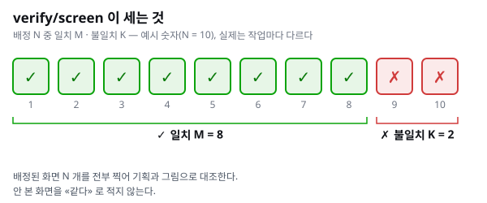
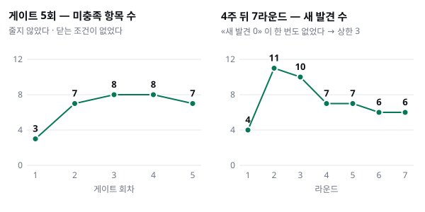

> **subflow 만들기 시리즈**
> [① AI 를 예측 가능하게 만드는 가장 작은 단위](../subflow-1-smallest-unit/) · ② 사고 한 건에서 계약 한 줄까지 (이 글) · [③ 갈라지고, 틀리고, 흐름이 되기까지](../subflow-3-grow-and-assemble/)

1편에서 subflow 는 **단계 하나의 계약**이고, 설계해서 만든 적이 없다고 했습니다. 그러면 실제로는 어떻게 만들었을까요. 이번 편은 그 절차입니다.

## 만드는 절차 — 7단계

```text
1 실물에서 한 번 돈다 → 2 이름을 붙인다 → 3 계약을 쓴다 → 4 경계를 정한다
→ 5 검수를 붙일지 정한다 → 6 계약 표에 등록하고 가드가 센다 → 7 기록한다
```

| # | 할 일 | 기준 |
| --- | --- | --- |
| 1 | 실물에서 한 번 돈다 | 설계부터 하지 않는다. 실제 작업 한 건에서 **발견**한다 |
| 2 | 이름을 붙인다 | 대표 키워드 하나 (`survey` · `rework` · `resolve` …) |
| 3 | 계약을 쓴다 | 입력 · 산출(어떤 축으로 셌나) · 통과 체크 · 결정 반출 · 반송지 |
| 4 | 경계를 정한다 | 각 축은 **다른 축의 산출을 입력으로 받지 않는다.** 이음새만 양쪽을 받는다 |
| 5 | 검수를 붙일지 정한다 | 산출이 다음 단계의 입력(=계약)이면 독립 검수를 붙인다 |
| 6 | 계약 표에 등록한다 | 표에 행이 없으면 rootflow 가 이을 수 없다. 가드가 센다 |
| 7 | 기록한다 | 결정 기록(ADR)에 남긴다 — 이 기록이 신설하는 것은 규범이 아니라 **자리**다 |

실제 대화에서 이 절차를 시작하는 말은 짧았습니다.

> 워크플로우에 해당 subflow 도 만들어라.

아래 두 사례는 근거가 가장 두터운 것입니다. 둘 다 **절차를 한 번에 통과하지 않았습니다.** 첫 주행 뒤 같은 날, 또는 몇 주 뒤에 다시 고쳐졌습니다.

## 사례 ① 기계가 초록인데 화면이 틀렸다 — `verify/screen` · `verify/log`

**계기** — 검증 단계(`verify`)는 기계만 셌습니다. 빌드, 테스트, 가드입니다. 그런데 게이트 셋이 모두 초록인데 며칠 전의 낡은 판도 똑같이 초록이었습니다. 무엇이 바뀌었는지 기계 검사로는 구별되지 않았던 겁니다.

규칙에는 «기기 검증은 사용자 몫» 이라는 문장이 있었는데 그 말은 이미 사용자가 뒤집은 상태였습니다. 로그 쪽에서도 문제가 나왔습니다. 같은 호출을 두 번 하고 응답을 버리는 버그가 있었고 크래시 탐지기가 실제로는 0건인데 5건이라고 거짓 경보를 냈습니다.

| 절차 | 실제로 한 일 |
| --- | --- |
| ① 실물에서 돈다 | 기기에서 화면을 확인하는 스크립트를 새로 만들고, 같은 날 그것으로 수리 2건을 잡았다. 사용자: «화면도 니가 확인할 수 있네» |
| ② 이름 | 제안은 «셋을 새로 만들고 `verify` 를 `verify/machine` 으로 이름을 바꾸자» 였다. 사용자가 «`verify` 는 그대로» 로 바로잡았다. 하나(`verify/device`)로 묶자는 안도 기각했다 |
| ③ 계약 | 계약 표에 세 행 추가 (`test-plan` · `verify/screen` · `verify/log`). 화면은 세 가지 수(N · M · K), 로그는 네 가지 수(N · M · K · C)로 센다 |
| ④ 경계 | 두 축은 **서로의 산출을 입력으로 받지 않는다.** 출시용 정리 단계 앞에서 끝나고, 기기 설치는 이 단계가 직접 한다 |
| ⑤ 검수 | «맞게 보이나» 는 의미 판정이라 기계로 못 잰다 → 통과 체크 문구와 독립 검수가 맡는다 |
| ⑥ 등록 + 가드 | 반영 뒤 «선언 24 = 계약 표 24 = 키워드 표 24» 를 가드가 확인 |
| ⑦ 기록 | 결정 기록 한 건 |

**첫 주행 뒤 같은 날 보강했습니다.** «0건» 이 통과가 아니라 **측정 실패**였던 거짓 초록, 그리고 도구 결함 3건이 나왔습니다. 그래서 «무엇을 몇 개 쟀나(분모)» 를 확인하는 문장을 규칙에 넣었습니다. 새 결정 기록은 내지 않았습니다.

그렇게 쓴 계약은 지금 헌법에서 이렇게 생겼습니다 (일부 생략).

| subflow | ① 입력 | ③ 산출 + 셈의 축 | ④ 통과 체크 |
| --- | --- | --- | --- |
| `verify/screen` | 테스트 계획의 **화면 축 행만** + 기획 정본(Figma · 화면 기획). **`verify/log` 산출 금지** | 화면마다 스크린샷 + 기획 대조표 · **축**: 배정 N 중 일치 M · 불일치 K | 배정 **전건** 촬영 · 대조는 **그림으로** (치수 · 파일명 일치는 근거가 아니다) · **안 본 화면을 «같다» 로 적지 않는다** |
| `verify/log` | 테스트 계획의 **로그 축 행만** + API 연결표. **`verify/screen` 산출 금지** | 전체 로그 1벌 + 요청 순서 · 상태 전이 대조 · **축**: 배정 N 중 전이 일치 M · 비정상 응답 K · 앱 크래시 C | **좁혀 잡지 않는다 — 전체를 받아 훑는다** · 탐지기가 0 아닌 값을 내면 **코드보다 탐지기를 먼저 의심** |

«서로의 산출 금지» 가 입력 칸에 박혀 있는 이유도 조문에 적혀 있습니다. *화면이 «맞다» 를 먼저 보면 로그 축이 그 결론에 맞춰 읽힌다.*



> **배운 것** — 축을 나누는 순간 «서로의 산출을 받지 않는다» 는 경계가 생깁니다. 그리고 그 경계가 **다른 단계의 설계까지 바꿨습니다.** 출시 단계에 기대던 기기 설치를 검증 단계가 직접 하게 된 것입니다.

## 사례 ② 검수가 닫히지 않았다 — `rework`

**계기** — 한 리팩터링 작업에서 완료 기준 게이트를 5번 돌았는데 미충족 항목 수가 3 → 7 → 8 → 8 → 7 로 줄지 않았습니다. 언제 닫을지 정한 조건이 없어서 재량으로 돌고 있었습니다. 한 항목의 처분이 뒤집혔는데도 그 결정에 기대던 하류 작업이 무효가 되는지 아무도 계산하지 않았습니다.

규칙과 결정 기록을 뒤져 보니 **«되돌려 보내기» 를 맡은 단계가 0개**였습니다.

| 절차 | 실제로 한 일 |
| --- | --- |
| ① 실물에서 돈다 | 위의 5회전. 몇 번째 라운드에서 무엇을 찾았는지 산출에 남기지 않았다 |
| ② 이름 | 웹 어드민 저장소에서 먼저 쓰던 `rework` 를 옮겨 오라는 지시(«rework 하나가 없습니다»). 근거는 **이 저장소의 실측으로 다시** 썼다 |
| ③ 계약 | 입력 = 검수 실패, 또는 다시 써서 바뀐 계약 · 산출 = 반송지, 무효가 되는 것 목록, 라운드 · 반송지는 자기 자신이 아니다 · 닫는 조건 = «새 발견 0 이 2회 연속» |
| ④ 경계 | 무엇이 무효가 되는지는 rootflow 가 가진 **입력 의존표**를 따른다 · 수리는 항목마다 별도 세션에서 |
| ⑥ 등록 + 가드 | 계약 표에는 바로 행이 생겼고, 행을 세는 가드도 같은 커밋에서 만들었다. 🔴 그런데 **키워드 표에는 12일 동안 행이 없었다** |
| ⑦ 기록 | 결정 기록 한 건 |

**그 뒤로 두 번 더 고쳐졌습니다.**

- 4주 뒤: 7라운드를 돌았는데 «새 발견 0» 이 한 번도 안 나왔습니다(4 · 11 · 10 · 7 · 7 · 6 · 6). 그래서 **라운드 상한 3** 을 뒀습니다.
- 다시 1주 뒤: 라운드는 «처음부터 다시 하기» 가 아니라 **«앞 라운드를 개선하기»** 라고 정의를 바꿨습니다.



지금 헌법의 `rework` 행입니다 (일부 생략).

| subflow | ① 입력 | ③ 산출 + 셈의 축 | ④ 통과 체크 | ⑥ 실패 반송지 |
| --- | --- | --- | --- | --- |
| `rework` | 검수 **실패 산출**, 또는 다시 쓰기가 **계약을 바꿨다는 사실** | 반송지 · 무효화된 단계 목록 · 라운드 번호 · **축**: 라운드 N · 그 라운드 발견 M | 반송지가 **귀속 규칙**에 맞나 · 무효화가 **입력 의존표**를 따랐나 · **이미 해소된 항목 재반송 0** | **자기 자신은 반송하지 않는다** — 판정이 틀리면 그 판정을 만든 검수로 |

> **배운 것** — 계약을 썼어도 **표 하나가 뒤처질 수 있습니다.** 키워드 표가 12일 동안 비어 있었던 것처럼요. 그래서 지금은 «선언 수 = 계약 표 행 = 키워드 표 행» 을 사람이 아니라 **가드가 셉니다.**

## 절차에서 자주 놓치는 것

두 사례와 다른 subflow 들의 이력에서 반복해서 보인 것들입니다.

| 단계 | 놓치기 쉬운 것 |
| --- | --- |
| ② 이름 | 기존 이름을 바꾸고 싶어진다. `verify` 를 바꾸자는 제안이 기각됐듯, 이미 쓰는 이름은 두고 새 이름은 **새 자리에만** 붙인다 |
| ③ 계약 | 산출에 «무엇을 몇 개 셌나» 를 빼먹는다. 분모가 없으면 «0건» 이 통과인지 측정 실패인지 모른다 |
| ④ 경계 | 한 subflow 에 두 가지 판정을 넣는다. 통과 체크가 뭉개진다 (3편의 `disposition`) |
| ⑥ 등록 | 표 하나만 고친다. 그래서 셋을 가드가 같이 센다 |

## 정리

- subflow 는 **사고 한 건에서** 시작합니다. 실물에서 한 번 돌고 반복되는 자리에 이름을 붙입니다.
- 계약을 쓰고 경계를 정하고 표에 등록하고 기계가 세게 합니다.
- **한 번에 끝나지 않습니다.** 두 사례 모두 첫 주행 뒤에 다시 고쳐졌고 그게 정상입니다.

다음 편에서는 subflow 가 **갈라지고, 틀리고, 줄 세워져 흐름이 되는** 과정을 봅니다.

[← ① AI 를 예측 가능하게 만드는 가장 작은 단위](../subflow-1-smallest-unit/) · [③ 갈라지고 틀리고 흐름이 되기까지 →](../subflow-3-grow-and-assemble/)
